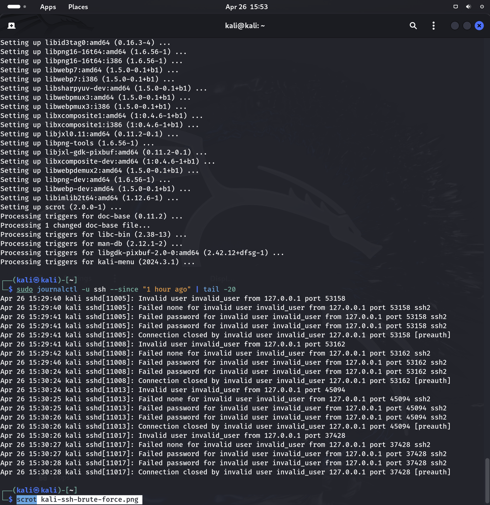
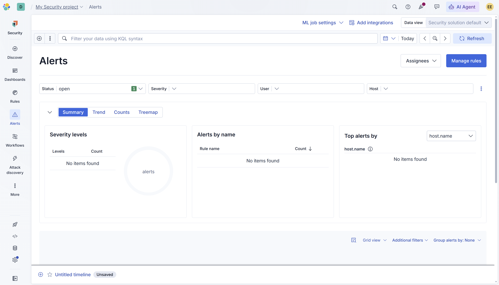
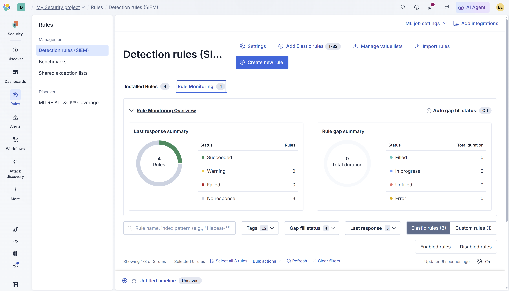

# SOC Lab 13 — Elastic Attack Simulation & Alerting

## Table of Contents
1. [Executive Summary](#executive-summary)
2. [Incident Ticket (ServiceNow Simulation)](#incident-ticket-servicenow-simulation)
3. [Lab Objectives](#lab-objectives)
4. [Environment Overview](#environment-overview)
5. [Attack Simulation](#attack-simulation)
6. [Detection Analysis](#detection-analysis)
7. [Detection Gap Analysis](#detection-gap-analysis)
8. [Detection Engineering Insights](#detection-engineering-insights)
9. [Evidence](#evidence)
10. [Conclusions](#conclusions)
11. [Next Steps](#next-steps)

---

## Executive Summary

This lab documents the simulation of SSH brute force attack activity on a Kali Linux host and the subsequent analysis of detection coverage within the Elastic SIEM environment.

Attack simulation is a critical component of detection engineering. By intentionally generating malicious activity in a controlled environment, analysts can validate whether detection rules are functioning as expected, identify coverage gaps, and improve the overall detection posture of the SIEM platform.

In this lab, repeated failed SSH authentication attempts were generated against the Kali Linux host to simulate a brute force credential attack. The Elastic SIEM detection rules were monitored for alert generation. A detection gap was identified — the SSH authentication logs were not being ingested into the correct Elastic data stream, preventing the detection rules from triggering. This gap was documented and analyzed as part of the detection engineering workflow.

---

## Incident Ticket (ServiceNow Simulation)

**Incident ID:** INC-0013
**Date/Time Detected:** 2026-04-26 15:29
**Detected By:** SOC Analyst (Lab Simulation)
**Severity:** Medium
**Category:** Attack Simulation / Detection Engineering
**Subcategory:** SSH Brute Force / Detection Gap

---

### Short Description
SSH brute force attack simulated on Kali Linux host. Multiple failed authentication attempts confirmed in system logs. Detection rules did not generate alerts due to log ingestion configuration gap.

---

### Detailed Description
A simulated SSH brute force attack was executed on the Kali Linux host by generating 10 consecutive failed authentication attempts against the local SSH service using an invalid username. The SSH service was confirmed running and the attack activity was verified in the system journal logs.

Analysis of the Elastic SIEM alert dashboard revealed no alerts were generated despite the attack activity. Investigation identified that the Kali Linux SSH authentication logs (stored in the systemd journal) were not being forwarded to the Elastic data streams monitored by the detection rules. The detection rules query `logs-system.auth-*` and `filebeat-*` index patterns, which did not contain the SSH failure events from the Kali host.

---

### Indicators of Compromise (IOCs)
- Source IP: 127.0.0.1
- Target: Local SSH service (port 22)
- Username: invalid_user
- Event type: Failed SSH authentication
- Log source: systemd journal (`/var/log/btmp`, journalctl)
- Frequency: 30+ failed attempts across 10 connection attempts

---

### Analysis
The attack simulation confirmed that SSH brute force activity was occurring on the Kali Linux host. The journalctl output clearly showed:

- Invalid user attempts from 127.0.0.1
- Failed password attempts per connection
- Connection closed entries confirming authentication denial

However, the Elastic detection rules did not trigger because the SSH authentication events from Kali's systemd journal were not being ingested into the `logs-system.auth-*` data stream. The Elastic Agent System integration was collecting metrics and event logs but was not configured to forward SSH-specific authentication logs from the journald source.

---

### Impact Assessment
- Attack simulation successfully executed and confirmed via system logs
- Detection gap identified: SSH auth logs not reaching Elastic data streams
- No alerts generated in Elastic SIEM
- Detection coverage incomplete for SSH brute force on Kali Linux

---

### Response Actions Taken
- Started SSH service on Kali Linux host
- Executed 10 consecutive SSH brute force attempts with invalid credentials
- Verified attack activity in systemd journal via journalctl
- Monitored Elastic Alerts dashboard for rule triggering
- Identified detection gap — SSH logs not ingested into monitored data streams
- Documented findings for remediation

---

### Recommended Actions
- Configure Elastic Agent to collect systemd journal logs from Kali Linux
- Add journald log collection to the System integration policy
- Re-test detection rules after log ingestion is corrected
- Implement alerting for repeated authentication failures across all Linux hosts
- Consider deploying Filebeat with the system module for broader auth log coverage

---

### Status
Open — Detection Gap Identified, Remediation Required

---

## Lab Objectives

- Simulate SSH brute force attack activity on Kali Linux host
- Monitor Elastic SIEM for alert generation
- Identify and document detection coverage gaps
- Analyze the relationship between log ingestion and detection effectiveness
- Build detection engineering skills through gap analysis

---

## Environment Overview

**Operating System:** Kali Linux (Virtual Machine)

**Tools Used**
- Elastic Security (Cloud Serverless)
- SSH (OpenSSH)
- journalctl
- Elastic Detection Rules

**Network Setup**
- Kali Linux VM with SSH service enabled
- Elastic Agent enrolled and sending logs to Elastic Cloud

---

## Attack Simulation

### SSH Service Preparation

The SSH service was started on the Kali Linux host prior to the attack simulation.

**Command:**

```bash
sudo systemctl start ssh
```

---

### Brute Force Execution

A loop was used to generate 10 consecutive failed SSH authentication attempts against the local SSH service using an invalid username.

**Command:**

```bash
for i in {1..10}; do ssh -o ConnectTimeout=5 invalid_user@127.0.0.1; done
```

Each connection attempt generated 3 failed password entries before being rejected, producing a total of 30 failed authentication events.

---

### Attack Verification

The attack activity was confirmed via the systemd journal:

**Command:**

```bash
sudo journalctl -u ssh --since "1 hour ago" | tail -20
```

**Output confirmed:**
- Invalid user `invalid_user` from 127.0.0.1
- Failed none and Failed password entries per connection
- Connection closed entries confirming authentication denial

---

## Detection Analysis

### Alert Dashboard Review

The Elastic Security Alerts dashboard was monitored following the attack simulation. No alerts were generated by any of the 4 configured detection rules.

### Rule Monitoring Review

The Rule Monitoring tab showed:
- 4 rules configured (3 Elastic prebuilt + 1 custom)
- 1 rule succeeded
- 3 rules with no response
- 0 failed rules
- 0 rule errors

---

## Detection Gap Analysis

### Root Cause

The SSH authentication failure events generated on the Kali Linux host are stored in the systemd journal and the `/var/log/btmp` binary log file. The Elastic Agent System integration, as currently configured, does not collect these specific log sources from Kali Linux.

The detection rules query the following index patterns:
- `filebeat-*`
- `logs-system.auth-*`

Neither of these data streams contained the SSH failure events from the Kali host, resulting in no alert generation despite confirmed malicious activity.

### Detection Gap Summary

| Component | Status |
|-----------|--------|
| SSH brute force executed | Confirmed |
| Attack logs on host | Confirmed (journalctl) |
| Logs ingested to Elastic | Not confirmed |
| Detection rules triggered | No |
| Alerts generated | No |

### Remediation Plan

To close this detection gap, the following actions are required:
- Configure the Elastic Agent System integration to collect journald logs
- Add the auth log path to the System integration policy
- Validate ingestion by querying `logs-system.auth-*` in Discover
- Re-run the brute force simulation and confirm alert generation

---

## Detection Engineering Insights

- A SIEM is only effective when the correct log sources are ingested — detection rules cannot fire on data they cannot see
- Identifying detection gaps through attack simulation is a core SOC analyst and detection engineer skill
- The gap between attack execution and alert generation must be traced systematically: host logs → agent collection → data stream → rule query → alert
- Real-world SOC environments frequently have detection gaps due to misconfigured log sources, agent policy misconfigurations, or coverage blind spots
- Documenting detection gaps is as valuable as documenting successful detections — it demonstrates analytical depth and systematic thinking
- SSH brute force is one of the most common attack vectors against Linux systems and must be covered by any mature detection program

---

## Evidence

All screenshots are stored in the repository and demonstrate attack simulation execution, alert dashboard review, and rule monitoring analysis.





---

## Conclusions

This lab successfully demonstrated the attack simulation and detection analysis workflow within the Elastic SIEM environment. SSH brute force activity was confirmed on the Kali Linux host through system journal logs, but detection rules did not generate alerts due to a log ingestion configuration gap.

The identification and documentation of this detection gap is itself a valuable outcome. In real-world SOC environments, detection engineers routinely perform attack simulations to validate coverage and identify blind spots. The ability to trace a detection failure from host logs to SIEM query is a critical analyst skill.

The remediation path is clear and will be implemented as part of ongoing lab development to achieve full end-to-end detection coverage.

---

## Next Steps

- Lab 14: Threat Hunting in Kibana
- Configure journald log collection to close the SSH detection gap
- Perform threat hunting queries in Kibana Discover
- Build analyst workflow from raw log analysis to threat identification
- Complete the Elastic labs phase of the portfolio
